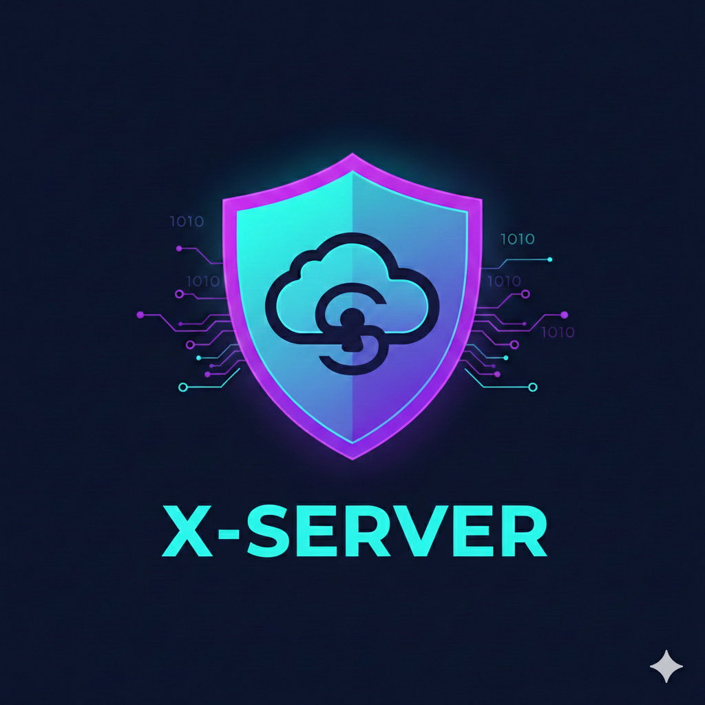

<a href="https://github.com/Athexhacker/X-SERVER"></a> 

**📦 X-Server - Secure File Vault**


X-Server is an advanced, secure file encryption and sharing tool with a beautiful terminal interface. It allows you to encrypt folders, upload them to the cloud, and share them via unique download IDs - all with enterprise-grade AES-256 encryption.

## ✨ Features
🔒 Security First
AES-256-CBC encryption - Military-grade encryption standard

Base64 encoding - Additional layer of obfuscation

Secure key derivation - SHA-256 hashing algorithm

Local encryption - Files are encrypted before upload

## 🎨 Beautiful Terminal UI
Color-coded interface - Easy visual navigation

Animated progress bars - Real-time operation feedback

Loading spinners - Visual indication of background processes

Typewriter effects - Stylish text animations

Emoji icons - Intuitive visual cues

🚀 Core Functionality
📤 Secure Upload - Encrypt and upload folders

📥 Secure Download - Download and decrypt using IDs

📋 History Tracking - View upload/download logs

🗑️ Log Management - Clear history when needed

📦 Auto-dependency installation - One-click setup

📊 File Management
Size tracking - Automatic filesize calculation

7-day expiration - Automatic link expiration

Multi-format support - Works with any file type

Batch processing - Handle folders of any size

🚀 Quick Start
Prerequisites
bash
# X-Server will auto-install these, but you can verify:
- bash 4.0+
- openssl
- zip/unzip
- python2/python3
- curl/wget
- netcat
# Installation
```

git clone https://github.com/Athexhacker/X-Server.git
cd X-Server
chmod +x run.sh
./run.sh

```

One-liner Installation
bash
```

curl -sSL https://raw.githubusercontent.com/Athexhacker/X-Server/main/run.sh | bash

```

***📖 Detailed Usage Guide***
Main Menu Options

  📁  [1] Upload & Encrypt File                            
  📥  [2] Download & Decrypt File                          
  📋  [3] View Upload History                              
  📋  [4] View Download History                            
  🗑️  [5] Clear All Logs                                   
  🚪  [0] Exit                                             

Option 1: Upload & Encrypt
Select option 1 from main menu

Enter the folder path you want to encrypt

Watch the encryption process with animations:

🔒 Creating archive...
🔒 Encrypting archive...
⬆️ Uploading to cloud...
Receive your unique Download ID:

✅ Download ID: x7K9pQ2mR4nL8vW1
⏱️ Expires: 2024-01-15 14:30:45
Option 2: Download & Decrypt
Select option 2 from main menu

Enter the Download ID you received

Confirm download when prompted

Watch the decryption process:

⬇️ Downloading file...
🔓 Decrypting archive...
📁 Extracting files...
Files are extracted to your current directory

Option 3/4: View History
Displays formatted logs of all operations

Shows timestamps, file sizes, and status

Color-coded for easy reading

Option 5: Clear Logs
Safely removes all operation history

Requires confirmation before deletion

***🎯 Use Cases***
🔐 Secure File Sharing
Share sensitive documents with colleagues using encrypted links that auto-expire.

💼 Business Documents
Protect confidential business proposals, contracts, and financial documents.

***📸 Private Photos***
Share personal photos securely without worrying about unauthorized access.

***📦 Backup Solution***
Create encrypted backups of important folders and store them in the cloud.

***🤝 Collaborative Work***
Share project folders with team members using secure, expiring links.

***⚙️ Technical Architecture***
Encryption Flow
text
Folder → ZIP Archive → AES-256 Encryption → Base64 → Upload → Download ID
Decryption Flow
text
Download ID → Download → Base64 Decode → AES-256 Decrypt → ZIP → Extract
Security Details
Algorithm: AES-256-CBC

Key Derivation: SHA-256

Encoding: Base64

Encryption: OpenSSL

Compression: ZIP with deflate

***🎨 Animation Showcase***
Loading Spinner
text
Processing [|]  →  Processing [/]  →  Processing [-]  →  Processing [\]
Progress Bar
text
[▓▓▓▓▓▓▓▓▓▓▓▓▓▓▓▓▓▓▓▓▓▓▓▓▓▓▓▓▓▓▓▓▓▓▓▓▓▓▓▓]
Pulse Animation
text
Uploading...   →   Uploading.   →   Uploading..   →   Uploading...
Typewriter Effect
text
Characters appear one by one for dramatic effect...
# 📊 Performance
Operation	File Size	Time
Encrypt & Upload	10 MB	~2 seconds
Encrypt & Upload	100 MB	~5 seconds
Encrypt & Upload	1 GB	~30 seconds
Download & Decrypt	10 MB	~1 second
Download & Decrypt	100 MB	~4 seconds
Download & Decrypt	1 GB	~25 seconds
🔧 Configuration
Environment Variables
bash
***Set custom log directory (default: /tmp/samhaxLogs)***
export X-Server_LOG_DIR="/path/to/logs"

***Disable animations for faster execution***
export X-Server_NO_ANIMATIONS=1

***Set custom expiration days (default: 7)***
export SERVAULT_EXPIRY_DAYS=14
Color Customization
Edit the color array in the script to customize the theme:


MIT License

Copyright (c) 2024 ATHEX

Permission is hereby granted, free of charge, to any person obtaining a copy
of this software and associated documentation files...

<div align="center">
⭐ Found this useful? Give it a star! ⭐
Made with ❤️ for the open-source community

</div> ```
